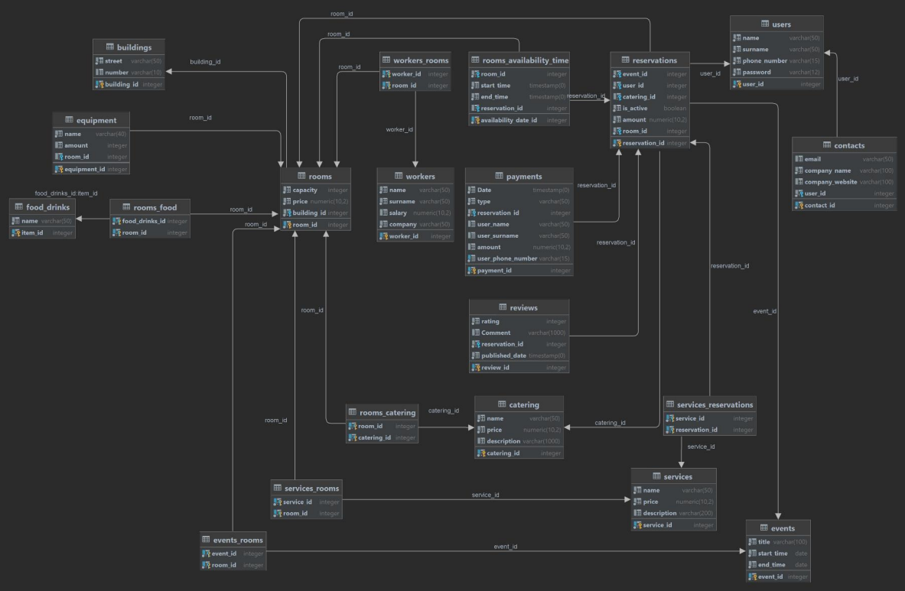

## Database - Meeting Rooms Booking System

### Description

This is a database for simple meeting rooms booking system. It allows users to book a meeting room for a specific time slot. The system will check if the room is available for the time slot and if it is, the booking will be made. Otherwise, the user will be notified that the room is not available for the time slot.

### Physical Model

Physical model generated automatically by DataGrip.

### Stack

Database is written using PostgreSQL and PL/pgSQL for triggers and functions.

### Triggers

For the perfomance reasons, some tables are denormalized. To keep the data consistent, triggers are used. For example, when user books a meeting room, his main data (name, surname, phone_number) are stored with his payment in Payments table.

### Functions

Functions are used to simplify the process of booking a meeting room. For example, get_available_rooms function returns all available rooms for a specified by user time slot.
